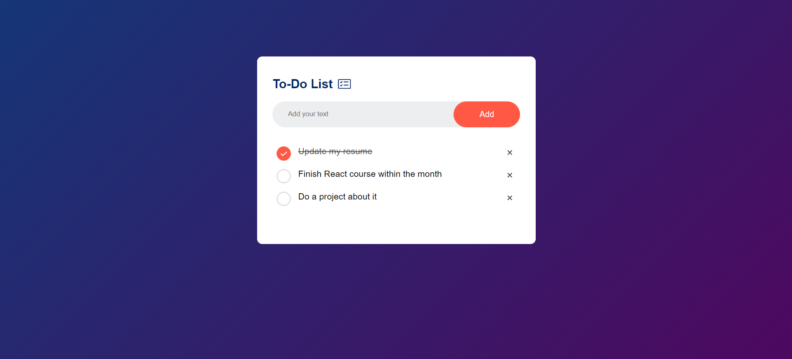

# To-Do-List
To-Do List Website is a web application that allows users to manage tasks by adding, editing, and deleting items from a list. It helps users organize their tasks efficiently with a simple and interactive interface.

## Features
<ul>-Ability to add tasks with titles and descriptions.</ul>
<ul>-Edit, mark as completed, or delete tasks.</ul>
<ul>-Allow users to create and manage their tasks.</ul>
<ul>-Ensures usability on various devices.</ul>

## Screenshot
<ul></ul>
